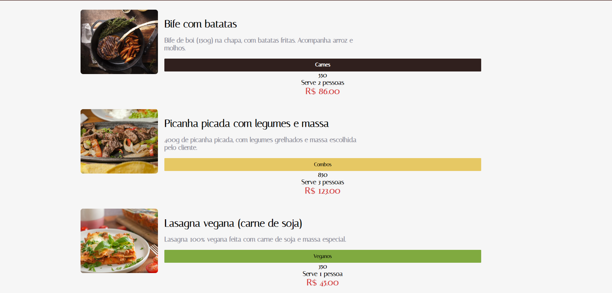

# Alura - Aluroni
 
This is a solution to the [React: lidando com arquivos estáticos](https://cursos.alura.com.br/course/react-arquivos-estaticos). Alura Front-end school help you improve your coding skills by building realistic projects.  

## Table of contents

- [Overview](#overview)
  - [The challenge](#the-challenge)
  - [Screenshot](#screenshot)
  - [Links](#links)
- [My process](#my-process)
  - [Built with](#built-with)
  - [What I learned](#what-i-learned)
  - [Continued development](#continued-development)
  - [Useful resources](#useful-resources)
- [Author](#author)

## Overview

This is the final project for "Aluroni" project using React and TypeScript.

### The challenge

Users should be able to:

- Navigate;
- search recipes in the searchbar
- separate the recipes by using the buttons: "massas", "carnes", "combos", "veganos"
- order the recipes by: "porção", "Quantidade de Pessoas", "preço"

### Screenshot

### Links

- Solution URL: [GitHub](https://github.com/ViniCellist/Alura-Aluroni)

## My process

Used React, TypeScript and SaSS.

### Built with

- React
- Sass
- TypeScript

### What I learned

practicing useEffect and useState

### Continued development

I know for sure that this projects opened my mind to see webpage creation in a whole new perspective

### Useful resources

- [React](https://react.dev/learn) - React documentation.
- [TypeScript](https://www.typescriptlang.org/docs/handbook/typescript-in-5-minutes.html) - TypeScript documentation.
- [Sass](https://sass-lang.com/documentation/) - Sass documentation.

## Author

- GitHub - [Projects](https://github.com/ViniCellist)
- Frontend Mentor - [Profile](https://www.frontendmentor.io/profile/ViniCellist)
- LinkedIn - [Professional](https://www.linkedin.com/in/viniciussouzaduarte/)
- Instagram - [Personal](https://www.instagram.com/vinicius_duartesd/)